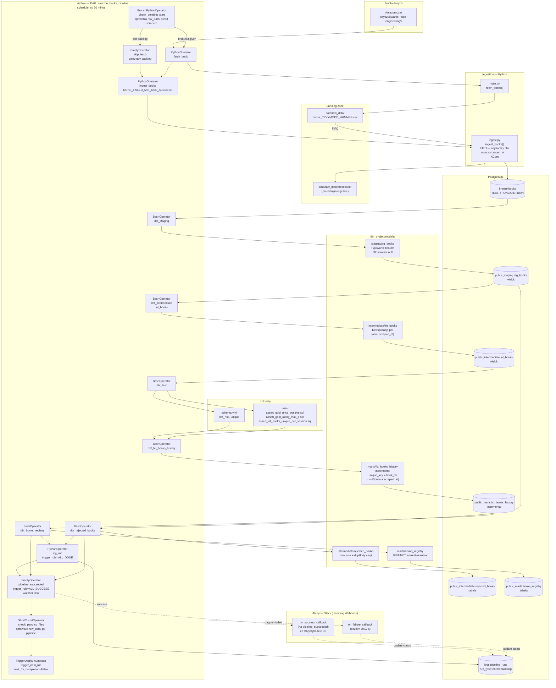

# Architektura projektu

## Przepływ danych

1. **Sprawdzenie backlogu** — `check_pending_start` (`BranchPythonOperator`) sprawdza `data/raw_data/` przed scrapingiem. Jeśli są zaległe pliki (late-arriving data) → gałąź `skip_fetch`, scraping pominięty. Jeśli nie ma → gałąź `fetch_book`, normalny flow.

2. **Scraping** — `fetch_book` wywołuje `fetch_books()` z `main.py`. Scraper odpytuje Amazon.com (keyword: `data engineering`, domyślnie 5 stron), rotuje User-Agenty, obsługuje retry przy challenge page lub HTTP 503. Wynik zapisuje do CSV z timestampem w `data/raw_data/`. Zwraca liczbę wierszy przez XCom. Autor scrapowany przez href z `/e/ASIN`.

3. **Bronze** — `ingest_books` bierze **najstarszy** plik z `data/raw_data/` (FIFO) i ładuje do `bronze.books` przez `TRUNCATE + INSERT`. Wszystkie kolumny są tekstowe (`TEXT`). Po udanym commicie plik jest przenoszony do `data/raw_data/processed/`. Zwraca `scraped_at` przetworzonej sesji przez XCom.

4. **Staging** (`stg_books`, widok) — typuje kolumny: `price::numeric`, `rating::numeric`, `scraped_at::timestamp`. Filtruje wiersze bez `asin`.

5. **Intermediate** — dwa modele uruchamiane równolegle po staging:
   - `int_books` (widok) — deduplikuje po `(asin, scraped_at)` przez `ROW_NUMBER()`. Gdy ten sam ASIN pojawia się wielokrotnie w jednej sesji, zostaje wiersz z kompletniejszymi danymi (`price` i `rating` not null mają priorytet).
   - `rejected_books` (tabela) — rejestr odrzuconych rekordów: brak `asin` w bronze + duplikaty sesji odfiltrowane przez `int_books`.

6. **Testy dbt** — uruchamiane po `int_books`, przed marts:
   - `schema.yml`: `book_sk` (unique, not_null), `asin` (not_null), `scraped_at` (not_null), `title` (not_null)
   - Singular testy: `price > 0`, `rating ∈ [0, 5]`, `(asin, scraped_at)` unique w `int_books`

7. **Marts** — dwa modele sekwencyjne:
   - `fct_books_history` (incremental) — kumuluje historię wszystkich sesji. `unique_key = book_sk = md5(asin || '_' || scraped_at)`. Każda para `(asin, scraped_at)` trafia do tabeli tylko raz. Brak filtra `WHERE scraped_at > MAX(scraped_at)` — chroni late-arriving data.
   - `books_registry` (tabela) — unikalny rejestr książek: `DISTINCT asin + title + author` z całego `fct_books_history`.

8. **Logi** — `log_run` uruchamia się zawsze (`trigger_rule=ALL_DONE`). Zapisuje do `logs.pipeline_runs`:
   - `run_type` — `'normal'` lub `'backlog'` (z XCom `check_pending_start`)
   - `scraped_count` — z XCom `fetch_book` (0 przy run_type=backlog)
   - `gold_inserted_count`, `registry_new_count` — liczone dla `scraped_at` z XCom `ingest_books`
   - `duration_seconds`, `status="pending_result"` (placeholder)

9. **Wykrywanie wyniku i alerty** — `pipeline_succeeded` (`EmptyOperator`, `trigger_rule=ALL_SUCCESS`, zależny od `log_run`) kończy się sukcesem tylko gdy realne taski biznesowe przeszły (watcher task pattern). `on_success_callback` odpytuje `logs.pipeline_runs` i wysyła Slack ze statystykami. `on_failure_callback` (DAG-level) wysyła alert o porażce.

10. **Kolejny run** — `check_pending_files` (`ShortCircuitOperator`) sprawdza czy w `data/raw_data/` zostały pliki. Jeśli tak — `trigger_next_run` (`TriggerDagRunOperator`) odpala kolejny run natychmiast bez czekania na harmonogram. `max_active_runs=1` zapobiega równoległemu uruchomieniu.

## Kluczowe decyzje architektoniczne

| Decyzja | Uzasadnienie |
|---|---|
| Bronze = TRUNCATE | Staging i intermediate zawsze widzą tylko bieżący scrape — bez historycznych śmieci |
| FIFO + self-trigger dla late data | Jeden run = jedna sesja = czyste statystyki; backlog oczyszczany bez czekania na harmonogram |
| `check_pending_start` przed scrapem | Scraping pomijany gdy jest backlog — bez tego każdy run tworzy nowy plik i kolejka nigdy nie maleje |
| Staging i int_books jako widoki | Brak kosztownych tabel pośrednich; dane materializują się tylko w marts |
| Surrogate key `book_sk = md5(asin + scraped_at)` | Jeden klucz zamiast composite key; łatwiejsze joiny |
| Brak filtra `is_incremental()` w gold | Filtr `WHERE scraped_at > MAX(scraped_at)` wykluczałby late-arriving data — celowa decyzja |
| `run_type` w logach | Odróżnia runy normalne od backlogowych — bez tego `scraped_count=0` wygląda jak błąd |
| `BACKLOG_BRANCH` stała w `logging_db.py` | Task_id gałęzi backlogowej w jednym miejscu — `pipeline.py` importuje stałą zamiast powielać string `"skip_fetch"` |
| `dag_failure_alert` bez `context["ti"]` | DAG-level callback nie ma `TaskInstance` w kontekście; `failed_task` zapisuje tylko `task_failure_logger` (per-task callback, jedyne miejsce z żywym wyjątkiem) |
| Slack alert budowany inline z f-stringiem | Jinja template `{{ run_id }}` może nie być renderowany w kontekście callbacka — f-string z `context["dag_run"].run_id` jest zawsze bezpieczny |
| `ingest_books` zwraca `scraped_at` przez XCom | `log_run` odpytuje gold dla konkretnej sesji, nie dla `MAX(scraped_at)` z bronze (które może być już nadpisane) |
| `rejected_books` w intermediate | Czyta tylko z bronze i stg_books — nie zależy od marts |
| `books_registry` jako tabela (nie incremental) | Zawsze przebudowywana — odzwierciedla aktualny stan `fct_books_history` |
| `trigger_rule=ALL_DONE` na log_run | Logi zawsze zapisywane — również przy błędach pipeline'u |
| `pipeline_succeeded` jako watcher task (`ALL_SUCCESS`) | `log_run` (`ALL_DONE`) jako jedyny liść grafu maskowałby każdą porażkę |
| `log_run >> pipeline_succeeded` | `dag_success_alert` odpytuje DB po statystyki — musi się wykonać po commicie `log_run` |
| `status` w `pipeline_runs` ustawiany przez callback, nie przez `log_run` | Airflow 3 blokuje bezpośredni dostęp do bazy metadanych z poziomu taska |
| UPSERT w `upsert_pipeline_run` | `log_run` i callback to równoległe ścieżki — kolejność nie jest gwarantowana |
